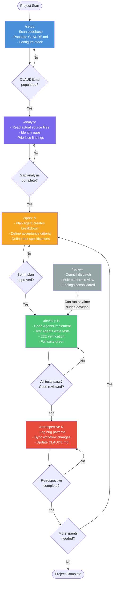
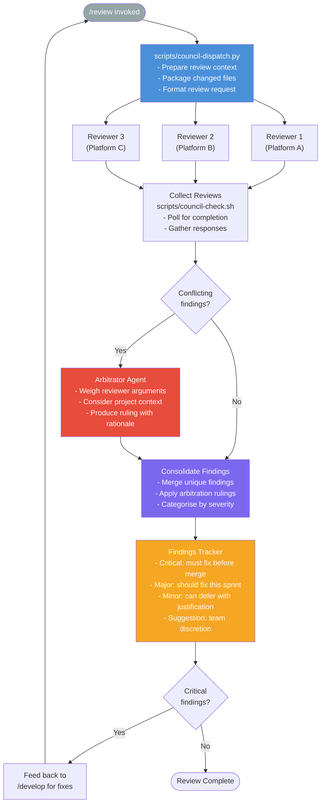
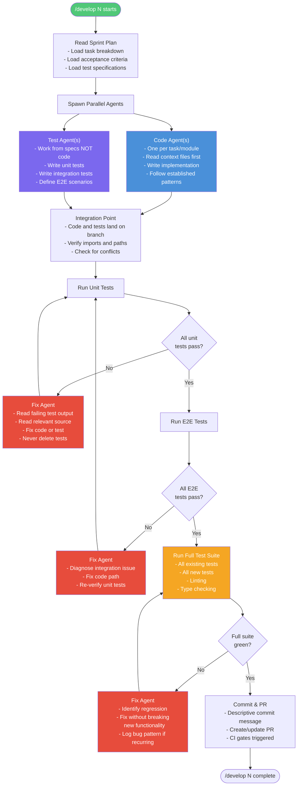

# Workflow Diagrams

Visual reference for the workflow pipeline, review process, development phase, and team sync flow.

---

## 1. Complete Pipeline Flow

The end-to-end workflow from project setup through iterative sprint delivery.

---

## 2. Council Review Detail

The `/review` process: dispatching to review platforms, arbitrating conflicts, and consolidating findings.

---

## 3. Development Phase Detail

The `/develop` phase: parallel code and test agents, E2E verification, fix loops, and full suite validation.

---

## 4. Team Sync Flow

How the workflow template stays synchronised across project repositories.

```mermaid
flowchart TD
    Template[("Workflow Template Repo\n- Skills\n- Rules\n- Scripts\n- Diagrams")]

    Template -->|"/sync pull"| ProjectA["Project A\n.claude/skills/\n.claude/workflow-rules.md\nscripts/"]
    Template -->|"/sync pull"| ProjectB["Project B\n.claude/skills/\n.claude/workflow-rules.md\nscripts/"]
    Template -->|"/sync pull"| ProjectC["Project C\n.claude/skills/\n.claude/workflow-rules.md\nscripts/"]

    ProjectA -->|"/sync push"| Template
    ProjectB -->|"/sync push"| Template
    ProjectC -->|"/sync push"| Template

    subgraph "Sync Pull Process"
        Pull1["1. Fetch latest from template repo"]
        Pull2["2. Compare tracked files"]
        Pull3["3. Apply updates preserving\nproject-specific overrides"]
        Pull4["4. Report changes applied"]
        Pull1 --> Pull2 --> Pull3 --> Pull4
    end

    subgraph "Sync Push Process"
        Push1["1. Identify modified workflow files"]
        Push2["2. Filter out project-specific overrides"]
        Push3["3. Create PR against template repo"]
        Push4["4. Mark files as synced"]
        Push1 --> Push2 --> Push3 --> Push4
    end

    subgraph "Retrospective Sync Check"
        Check1["1. Diff tracked files against\nlast sync point"]
        Check2{"Unsynchronised\nchanges?"}
        Check3["Block retrospective\ncompletion"]
        Check4["User chooses:\nA) /sync push\nB) Mark as override"]
        Check1 --> Check2
        Check2 -->|Yes| Check3 --> Check4
        Check2 -->|No| Check5([Proceed])
    end

    style Template fill:#4a90d9,color:#fff
    style ProjectA fill:#50c878,color:#fff
    style ProjectB fill:#50c878,color:#fff
    style ProjectC fill:#50c878,color:#fff
```

---

## Legend

| Colour | Meaning |
|--------|---------|
| Blue | Setup / Infrastructure |
| Purple | Analysis / Planning |
| Orange | Validation / Gating |
| Green | Implementation / Projects |
| Red | Fixes / Critical Review |
| Grey | Optional / Async |
