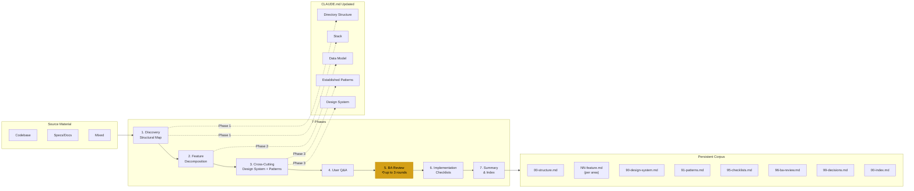
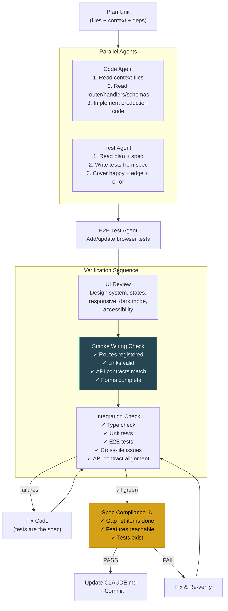
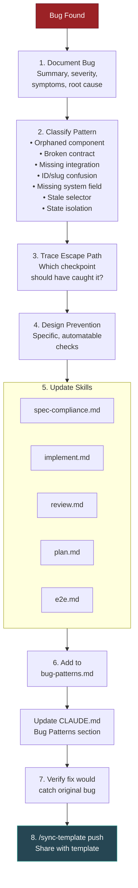
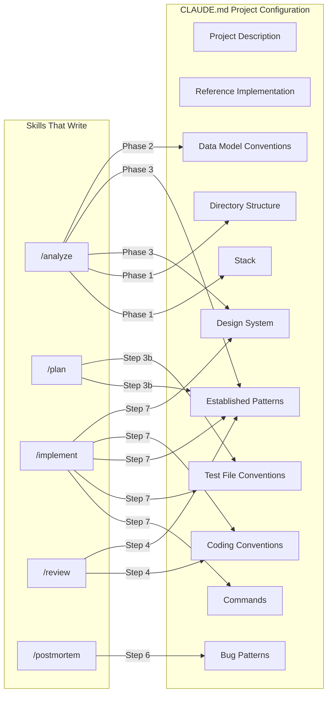
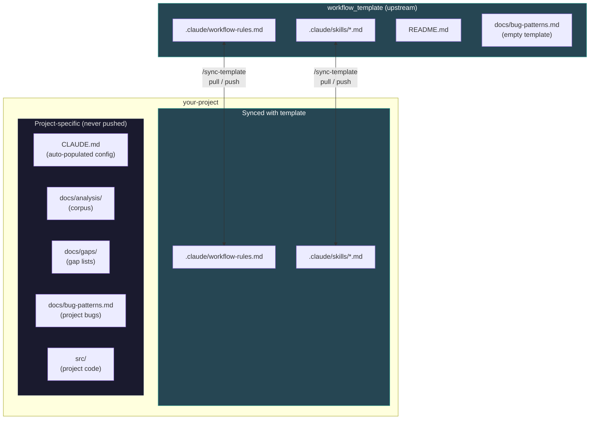

# Workflow Diagram

## Complete Pipeline

```mermaid
flowchart TB
    subgraph Phase0["Phase 0: Discovery"]
        analyze["/analyze<br/>Deep Analysis"]
        phase0["/phase-0<br/>Gap Analysis"]
        analyze --> phase0
    end

    subgraph Phase1["Phase 1: Planning"]
        plan["/plan<br/>Implementation Plan"]
        subgraph ReviewAgents["Parallel Review Agents"]
            arch["Architecture<br/>Agent"]
            sec["Security<br/>Agent"]
            perf["Performance<br/>Agent"]
            test["Testability<br/>Agent"]
            ui_rev["UI Review<br/>Agent"]
            spec_rev["Spec Compliance<br/>Agent ⚠️"]
        end
        plan --> ReviewAgents
    end

    subgraph Phase2["Phase 2: Implementation"]
        subgraph CodeAgents["Parallel Per-Unit Agents"]
            code["Code Agent<br/>(reads context files)"]
            tests["Test Agent<br/>(writes from spec)"]
        end
        e2e_agent["E2E Test Agent"]
        ui_check["UI Review"]
        smoke["Smoke Wiring Check"]
        integration["Integration Check<br/>type check + tests + E2E"]
        fix["Fix Failures"]
        spec_gate["Spec Compliance<br/>Gate ⚠️"]

        CodeAgents --> e2e_agent
        e2e_agent --> ui_check
        ui_check --> smoke
        smoke --> integration
        integration --> fix
        fix -->|"still failing"| integration
        fix -->|"all green"| spec_gate
    end

    subgraph Phase3["Phase 3: Verification"]
        predeploy["/pre-deploy"]
        subgraph Gates["Parallel Gate Checks"]
            g_tests["Test Suite"]
            g_types["Type Check"]
            g_lint["Lint"]
            g_sec["Security Scan"]
            g_deps["Dependency Check"]
            g_e2e["E2E Tests"]
            g_spec["Spec Compliance ⚠️"]
        end
        predeploy --> Gates
    end

    phase0 -->|"gap list"| plan
    ReviewAgents -->|"approved plan"| CodeAgents
    spec_gate -->|"PASS"| commit["Auto-Commit"]
    commit --> predeploy
    Gates -->|"ALL PASS"| deploy["Ready to Deploy"]
    Gates -->|"ANY FAIL"| block["Blocked ✖"]

    style Phase0 fill:#1a1a2e,stroke:#16213e,color:#e0e0e0
    style Phase1 fill:#1a1a2e,stroke:#16213e,color:#e0e0e0
    style Phase2 fill:#1a1a2e,stroke:#16213e,color:#e0e0e0
    style Phase3 fill:#1a1a2e,stroke:#16213e,color:#e0e0e0
    style spec_rev fill:#d4a017,stroke:#b8860b,color:#000
    style spec_gate fill:#d4a017,stroke:#b8860b,color:#000
    style g_spec fill:#d4a017,stroke:#b8860b,color:#000
    style deploy fill:#2d6a4f,stroke:#1b4332,color:#fff
    style block fill:#9b2226,stroke:#641220,color:#fff
    style commit fill:#2d6a4f,stroke:#1b4332,color:#fff
```

## Analyze Phase Detail

## Implementation Unit Detail

## Review Agents Detail

```mermaid
flowchart LR
    trigger["Code Changes<br/>(uncommitted or specified)"]

    subgraph Agents["5 Parallel Review Agents"]
        direction TB
        ui_agent["UI Review Agent<br/>• Design system compliance<br/>• Visual states (load/empty/error)<br/>• Responsive behaviour<br/>• Dark mode<br/>• Consistency<br/>• Accessibility"]
        arch_agent["Architecture Agent<br/>• Project conventions<br/>• API contract alignment<br/>• Form binding patterns<br/>• Link construction<br/>• Bug pattern check"]
        sec_agent["Security Agent<br/>• Auth/authz on endpoints<br/>• Input validation<br/>• Injection vectors<br/>• URL param resolution<br/>• No leaked secrets"]
        perf_agent["Performance Agent<br/>• Algorithm complexity<br/>• Re-render prevention<br/>• Caching strategy<br/>• Memory leaks"]
        test_agent["Test Coverage Agent<br/>• Unit test coverage<br/>• Edge case coverage<br/>• E2E test updates<br/>• Meaningful assertions"]
    end

    trigger --> Agents

    subgraph Report["Consolidated Report"]
        blocking["BLOCKING<br/>Must fix before merge"]
        should["SHOULD FIX<br/>Significant issues"]
        consider["CONSIDER<br/>Suggestions"]
    end

    Agents --> Report

    update["Update CLAUDE.md<br/>Coding Conventions<br/>Established Patterns"]
    Report -.-> update

    style blocking fill:#9b2226,stroke:#641220,color:#fff
    style should fill:#d4a017,stroke:#b8860b,color:#000
    style consider fill:#264653,stroke:#2a9d8f,color:#fff
```

## Postmortem & Self-Improvement Loop

## CLAUDE.md Auto-Population Flow

## Upstream Sync Architecture

